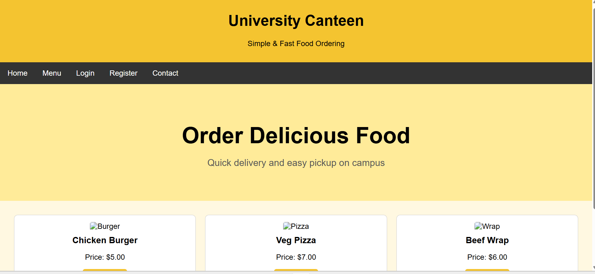

# 🍽️ Canteen Management System

### A Simple & Efficient Web-Based Canteen Management Solution

  
  
  

  

---

## 📌 Project Overview

The **Canteen Management System** is a web-based application designed to simplify and organize daily canteen operations. It provides a simple and user-friendly interface for managing food items and orders efficiently.

The project was developed using **HTML, CSS, and JavaScript**, with a focus on simplicity, usability, and efficient order management.

## 📸 Project Preview

## 🛠️ Technologies Used

## ✨ Key Features

- 🍽️ View available food items
- 🛒 Manage food orders
- 📋 Simple and organized menu interface
- 🖥️ User-friendly web interface
- ⚡ Interactive functionality using JavaScript
## 📦 Dependencies

This project does not require any external dependencies or packages.

It is built using vanilla **HTML and CSS**.

